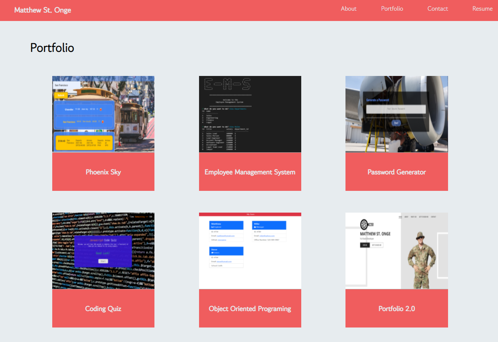

# React-Portfolio

HW #20 UofA coding bootcamp

## Description

This personal portfolio is built using React 


## Table of Contents

* [License](#license)

* [Installation](#installation)

* [Usage](#usage)

* [Credits](#credits)

* [Questions](#questions)

---

## License
 
[MIT License](https://github.com/git/git-scm.com/blob/main/MIT-LICENSE.txt)

## Installation

```
npm i
```

## Usage

```
npm start
```




## Credits

MIT badge is displayed using another GitHub user links [Lukas Himsel](https://gist.github.com/lukas-h/2a5d00690736b4c3a7ba)

## Questions

If you feel you have any questions, please feel free to reach out to me at stonge.ms@gmail.com

## Author
Matthew St. Onge